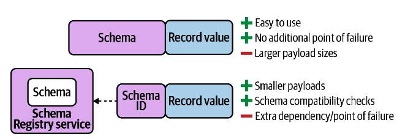

## Processing a Twitter Stream
We will explore the use case of algorithmic trading. Sometimes called high-frequency trading (HFT), 
this lucrative practice involves building software to evaluate and purchase securities automatically, by processing 
and responding to many types of market signals with minimal latency.

To assist our fictional trading software, we will build a stream processing application that will help us gauge 
market sentiment around different types of cryptocurrencies (Bitcoin, Ethereum, Ripple, etc.), and use these sentiment 
scores as investment/divestment signals in a custom trading algorithm. Since millions of people use Twitter 
to share their thoughts on cryptocurrencies and other topics, we will use Twitter as the data source for our application.

## Topology


## Running Locally
Once Docker Compose is installed, you can start the local Kafka cluster using the following command:

```sh
$ docker-compose up
```

## Producing Test Data
We have a couple of test records saved to the data/test.json file, which is mounted in the kafka container for convenience. Feel free to modify the data in this file as you see fit. Then, run the following command to produce the test data to the source topic (tweets).
  
```sh
$ docker-compose exec kafka bash

$ kafka-console-producer \
  --bootstrap-server kafka:9092 \
  --topic tweets < test.json
```
  
Then, in another tab, run the following command to consume data from the sink topic (crypto-sentiment).

```sh  
$ docker-compose exec schema-registry bash

$ kafka-avro-console-consumer \
    --bootstrap-server kafka:9092 \
    --topic crypto-sentiment \
    --from-beginning
```

You should see records similar to the following appear in the sink topic.

```json lines
{"created_at":1577933872630,"entity":"bitcoin","text":"Bitcoin has a lot of promise. I'm not too sure about #ethereum","sentiment_score":0.3444212495322003,"sentiment_magnitude":0.9464683988787772,"salience":0.9316858469669134}
{"created_at":1577933872630,"entity":"ethereum","text":"Bitcoin has a lot of promise. I'm not too sure about #ethereum","sentiment_score":0.1301464314096875,"sentiment_magnitude":0.8274198304784903,"salience":0.9112319163372604}
```

#### Avro
When working with Avro, you can use either generic records or specific records. Generic records are suitable when
the record schema isn’t known at runtime. They allow you to access field names using generic getters and setters. 
For example: `GenericRecord.get(String key)` and `GenericRecord.put(String key, Object value)`.
  
Specific records, on the other hand, are Java classes that are generated from Avro schema files. 
They provide a much nicer interface for accessing record data.

#### Generating avro files
```sh
$ gradle build && gradle idea
```

#### Serializing Avro Data
When we serialize data using Avro, we have two choices:  
- Include the Avro schema in each record.  
- Ise an even more compact format, by saving the Avro schema in Confluent Schema Registry, and only 
  including a much smaller schema ID in each record instead of the entire schema

The benefit of the first approach is you don’t have to set up and run a separate service alongside 
your Kafka Streams application. Since Confluent Schema Registry is a REST service for creating 
and retrieving Avro, Protobuf, and JSON schemas, it requires a separate deployment and therefore 
introduces a maintenance cost and an additional point of failure. However, with the first approach, 
you do end up with larger message sizes since the schema is included.

However, if you are trying to eke every ounce of performance out of your Kafka Streams application, 
the smaller payload sizes that Confluent Schema Registry enables may be necessary. Furthermore, 
if you anticipate ongoing evolution of your record schemas and data model, the schema compatibility 
checks that are included in Schema Registry help ensure that future schema changes are made in safe, 
non-breaking ways




### Adding a Sink Processor
There are a few operators for doing this:
- to
- through
- repartition
  
If you want to return a `new KStream` instance for appending additional operators/stream processing logic, 
then you should use the repartition or through operator (the latter is deprecated, but is still widely used a
nd backward compatibility is expected).   
Internally, these operators call `builder.stream` again, so 
using them will result in additional sub-topologies being created by Kafka Streams. 
However, if you have reached a terminal step in your stream, as we have, then you should use the `to` operator, 
which returns void since no other stream processors need to be added to the underlying `KStream`.