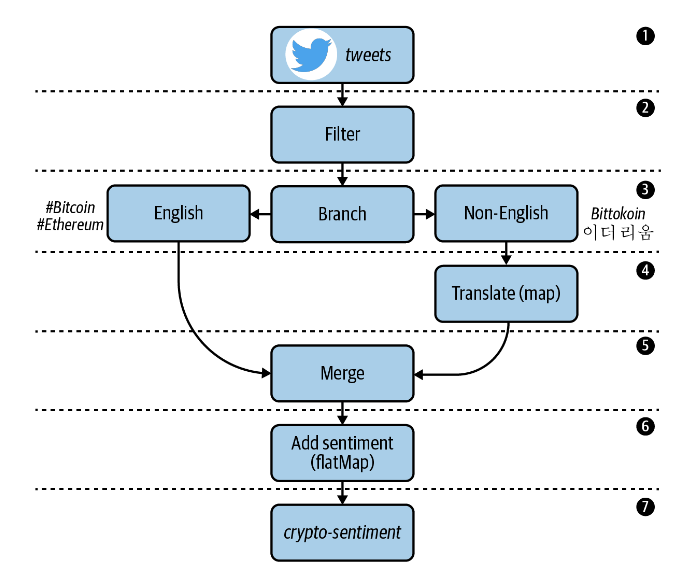

## Processing a Twitter Stream
We will explore the use case of algorithmic trading. Sometimes called high-frequency trading (HFT), 
this lucrative practice involves building software to evaluate and purchase securities automatically, by processing 
and responding to many types of market signals with minimal latency.

To assist our fictional trading software, we will build a stream processing application that will help us gauge 
market sentiment around different types of cryptocurrencies (Bitcoin, Ethereum, Ripple, etc.), and use these sentiment 
scores as investment/divestment signals in a custom trading algorithm. Since millions of people use Twitter 
to share their thoughts on cryptocurrencies and other topics, we will use Twitter as the data source for our application.

## Topology


## Running Locally
Once Docker Compose is installed, you can start the local Kafka cluster using the following command:

```sh
$ docker-compose up
```

## Producing Test Data
We have a couple of test records saved to the data/test.json file, which is mounted in the kafka container for convenience. Feel free to modify the data in this file as you see fit. Then, run the following command to produce the test data to the source topic (tweets).
  
```sh
$ docker-compose exec kafka bash

$ kafka-console-producer \
  --bootstrap-server kafka:9092 \
  --topic tweets < test.json
```
  
Then, in another tab, run the following command to consume data from the sink topic (crypto-sentiment).

```sh  
$ docker-compose exec schema-registry bash

$ kafka-avro-console-consumer \
    --bootstrap-server kafka:9092 \
    --topic crypto-sentiment \
    --from-beginning
```

You should see records similar to the following appear in the sink topic.

```json lines
{"created_at":1577933872630,"entity":"bitcoin","text":"Bitcoin has a lot of promise. I'm not too sure about #ethereum","sentiment_score":0.3444212495322003,"sentiment_magnitude":0.9464683988787772,"salience":0.9316858469669134}
{"created_at":1577933872630,"entity":"ethereum","text":"Bitcoin has a lot of promise. I'm not too sure about #ethereum","sentiment_score":0.1301464314096875,"sentiment_magnitude":0.8274198304784903,"salience":0.9112319163372604}
```