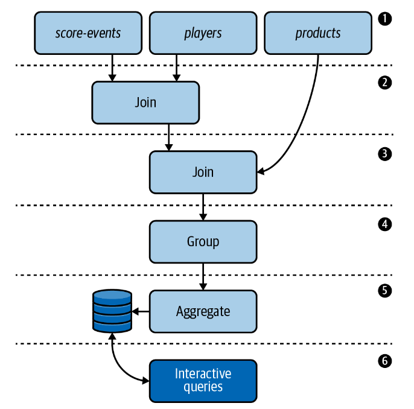

## Video Game Leaderboard
we will learn about stateful processing by implementing a video game leaderboard with Kafka Streams. 
The video game industry is a prime example of where stream processing excels, since both gamers and game systems 
require low-latency processing and immediate feedback.

## Topology


## Running Locally
Once Docker Compose is installed, you can start the local Kafka cluster using the following command:

```sh
$ docker-compose up
```

## Producing Test Data
Once your application is running, you can produce some test data to see it in action. Since our video game 
leaderboard application reads from multiple topics (`players`, `products`, and `score-events`), we have saved example 
records for each topic in the `data/ directory`. To produce data into each of these topics, open a new tab in your 
shell and run the following commands.
  
```sh
# log into the broker, which is where the kafka console scripts live
$ docker-compose exec kafka bash

# produce test data to players topic
$ kafka-console-producer \
  --bootstrap-server kafka:9092 \
  --topic players \
  --property 'parse.key=true' \
  --property 'key.separator=|' < players.json

# produce test data to products topic
$ kafka-console-producer \
  --bootstrap-server kafka:9092 \
  --topic products \
  --property 'parse.key=true' \
  --property 'key.separator=|' < products.json

# produce test data to score-events topic
$ kafka-console-producer \
  --bootstrap-server kafka:9092 \
  --topic score-events < score-events.json
```

## KStream, KTable and GlobalKTable
https://www.confluent.io/blog/crossing-streams-joins-apache-kafka/