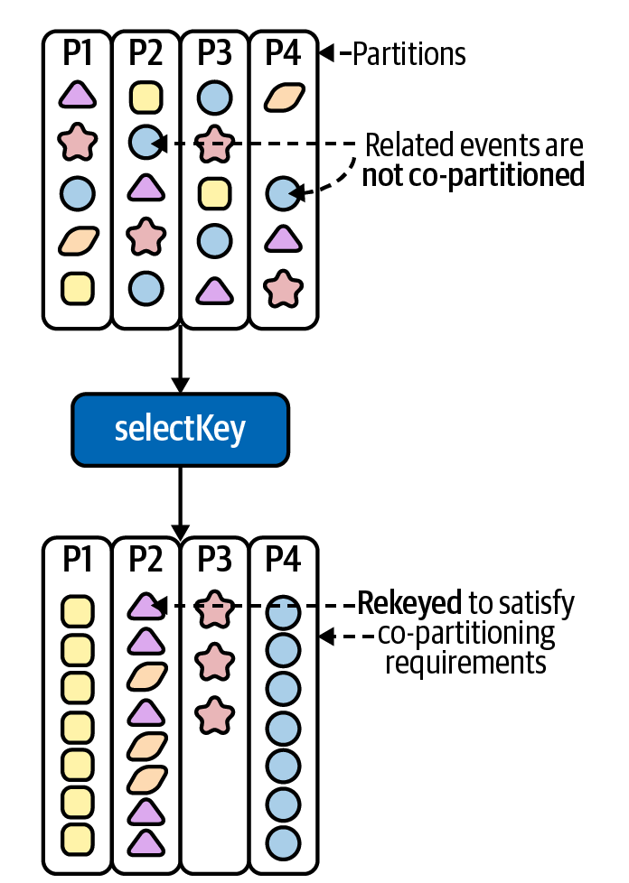

## Video Game Leaderboard
we will learn about stateful processing by implementing a video game leaderboard with Kafka Streams. 
The video game industry is a prime example of where stream processing excels, since both gamers and game systems 
require low-latency processing and immediate feedback.

## Topology


## Running Locally
Once Docker Compose is installed, you can start the local Kafka cluster using the following command:

```sh
$ docker-compose up
```

## Producing Test Data
Once your application is running, you can produce some test data to see it in action. Since our video game 
leaderboard application reads from multiple topics (`players`, `products`, and `score-events`), we have saved example 
records for each topic in the `data/ directory`. To produce data into each of these topics, open a new tab in your 
shell and run the following commands.
  
```sh
# log into the broker, which is where the kafka console scripts live
$ docker-compose exec kafka bash

# produce test data to players topic
$ kafka-console-producer \
  --bootstrap-server kafka:9092 \
  --topic players \
  --property 'parse.key=true' \
  --property 'key.separator=|' < players.json

# produce test data to products topic
$ kafka-console-producer \
  --bootstrap-server kafka:9092 \
  --topic products \
  --property 'parse.key=true' \
  --property 'key.separator=|' < products.json

# produce test data to score-events topic
$ kafka-console-producer \
  --bootstrap-server kafka:9092 \
  --topic score-events < score-events.json
```

## KStream, KTable and GlobalKTable
The deep dive with examples:  
- https://www.confluent.io/blog/crossing-streams-joins-apache-kafka/

### Topology
The `score-events` topic contains raw score events, which are unkeyed (and therefore, distributed in a round-robin fashion) 
in an uncompacted topic. Since tables are key-based, this is a strong indication that we should be using a 
KStream for our unkeyed `score-events` topic

The `players` topic is a compacted topic that contains player profiles, and each record is keyed by the player ID. 
Since we only care about the latest state of a player, it makes sense to represent this topic using a table-based abstraction

The `products` topic. This topic is relatively small, so we should be able to replicate the state in full across all of 
our application instances. Let’s take a look at the abstraction that allows us to do this: `GlobalKTable`.

| Kafka topic  | Abstraction  |
|--------------|--------------|
| score-events | KStream      |
| players      | KTable       |
| products     | GlobalKTable |

#### Repartitioning

  
When we add a key-changing operator to our topology, the underlying data will be marked for repartitioning. 
This means that as soon as we add a downstream operator that reads the new key, Kafka Streams will:
 - Send the rekeyed data to an internal repartition topic
 - Reread the newly rekeyed data back into Kafka Streams
This process ensures related records (i.e., records that share the same key) will be processed by the same task 
in subsequent topology steps. However, the network trip required for rerouting data to a special repartition 
topic means that rekey operations can be expensive.
  
Co-partitioning is not required for `GlobalKTable` joins since the state is fully replicated across 
each instance of our Kafka Streams app.