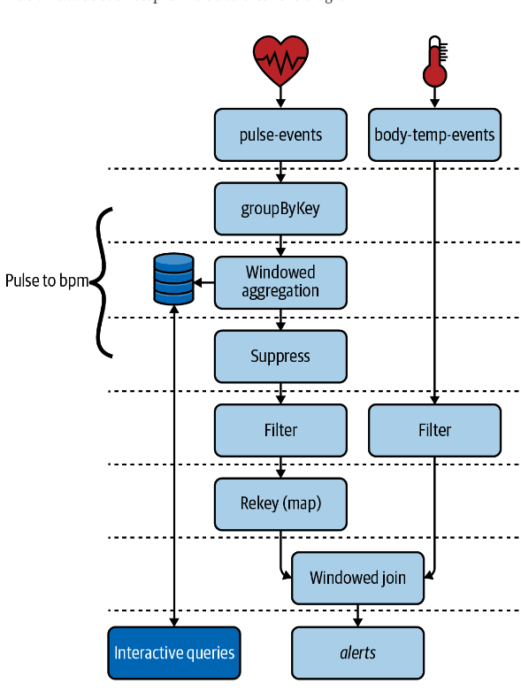

## Patient Monitoring Application
We will try to detect the presence of a medical condition called systemic inflammatory response syndrome, or SIRS. 
According to Bridgette Kadri, a physician’s assistant at the Medical University of South Carolina, there are several 
vital signs, including body temperature, blood pressure, and heart rate, that can be used as indicators of SIRS. 
In this tutorial, we will look at two of these measurements: body temperature and heart rate. When both of these 
vitals reach predefined thresholds (heart rate >= 100 beats per minute, body temperature >= 100.4°F), we will send 
a record to alerts topic to notify the appropriate medical personne

## Topology

1. Our Kafka cluster contains two topics that capture patient vitals measurements: 
   1. The `pulse-events` topic is populated by a heartbeat sensor. Every time the sensor picks up a patient’s heartbeat, it appends a record to this topic. Records are keyed by patient ID.
   2. The `body-temp-events` topic is populated by a wireless body temperature sensor. Every time the patient’s core body temperature is taken, a record is appended to this topic. These records are also keyed by patient ID.
2. In order to detect elevated heart rates, we need to convert the raw pulse events into a heart rate (measured using beats per minute, or bpm). As we learned in the previous chapter, we must first group the records to satisfy Kafka Streams’ prerequisite for performing aggregations.
3. We will use a windowed aggregation to convert the pulse events into a heart rate. Since our unit of measurement is beats per minute, our window size will be 60 seconds.
4. We will use the suppress operator to only emit the final computation of the bpm window.
5. In order to detect an infection, we will filter all vitals measurements that breach a set of predefined thresholds (heart rate >= 100 beats per minute, body temperature >= 100.4°F).
6. Windowed aggregations change the record key. Therefore, we’ll need to rekey the heart rate records by patient ID to meet the co-partitioning requirements for joining records.
7. We will perform a windowed join to combine the two vitals streams. Since we are performing the join after filtering for elevated bpm and body temperature measures, each joined record will indicate an alerting condition for SIRS.
8. Finally, we will expose the results of our heart rate aggregation via interactive queries. We will also write the output of our joined stream to a topic called alerts.

## Running Locally
Once Docker Compose is installed, you can start the local Kafka cluster using the following command:

```sh
$ docker-compose up
```

## Producing Test Data
Once your application is running, you can produce some test data to see it in action. Since our patient monitoring 
application reads from multiple topics (`pulse-events`, `body-temp-events`), we have saved example records for each 
topic in the `data/` directory. To produce data into each of these topics, open a new tab in your shell and run the following commands.  
```sh
# log into the broker, which is where the kafka console scripts live
$ docker-compose exec kafka bash

# produce test data to pulse-events topic
$ kafka-console-producer \
  --bootstrap-server kafka:9092 \
  --topic pulse-events \
  --property 'parse.key=true' \
  --property 'key.separator=|' < pulse-events.json

# produce test data to body-temp-events topic
$ kafka-console-producer \
  --bootstrap-server kafka:9092 \
  --topic body-temp-events \
  --property 'parse.key=true' \
  --property 'key.separator=|' < body-temp-events.json
```

### Consuming the alerts
This Kafka Streams application writes to an `alerts` topic whenever a patient experiences a combination of symptoms 
that could indicate an infection (high heart rate and body temperature). After producing the test data, you can view 
the alerts that were generated by consuming from the `alerts` topic. The following command shows how to do that.
```sh
# log into the broker, which is where the kafka console scripts live
$ docker-compose exec kafka bash

# consume from the beginning of the alerts topic
$ kafka-console-consumer \
  --bootstrap-server kafka:9092 \
  --topic alerts \
  --from-beginning
```

### Time Semantics
* Event time  
When an event was created at the source. This timestamp can be embedded in the payload of an event, or set directly using the Kafka producer client as of version 0.10.0.
  
* Ingestion time  
When the event is appended to a topic on a Kafka broker. This always occurs after event time.

* Processing time  
When the event is processed by your Kafka Streams application. This always occurs after event time and ingestion time. It is less static than event time, and reprocessing the same data (i.e., for bug fixes) will lead to new processing timestamps, and therefore nondeterministic windowing behavior.

Kafka producers allow the default timestamp that gets set for each record to be overridden, which can also be used to 
achieve event-time semantics. However, for systems that use this method for associating timestamps with events, 
it’s important to be aware of two Kafka configurations (one at the broker level and one at the topic level) to 
ensure you don’t accidentally end up with ingestion-time semantics. The relevant configurations are:
  
* `log.message.timestamp.type` (broker level)
* `message.timestamp.type` (topic level)
  
There are two possible values for these configs: `CreateTime` or `LogAppendTime`. Furthermore, the topic-level config 
takes precedence over the broker-level config. If the topic is configured with the LogAppendTime timestamp type,
the timestamp that the producer appends to the message will be overwritten with the local system time of the broker 
whenever a record is appended to the topic (therefore, you’ll be working with ingestion-time semantics, even if 
that wasn’t your intent). If you want to achieve event-time semantics and you’re relying on the producer timestamp, 
be sure that you are using CreateTime as the message timestamp type.

#### Window Types
* `Tumbling windows` are fixed-sized windows that never overlap. They are defined using a single property, the window size (in milliseconds), and have predictable time ranges since they are aligned with the epoch
* `Hoping windows` are fixed-sized windows that may overlap. When configuring a hopping window, you must specify both the window size and the advance interval (how much the window moves forward). When the advance interval is less than the window size, then windows will overlap, allowing some records to appear in multiple windows
* `Session windiows` are variable-sized windows that are determined by periods of activity followed by gaps of inactivity. A single parameter called the inactivity gap is used to define a session window. If the inactivity gap is five seconds, then each record that has a timestamp within five seconds of the previous record with the same key will be merged into the same window. Otherwise, if the timestamp of a new record is greater than the inactivity gap (in this case, five seconds), then a new window will be created
* `Sliding join windws` are fixed-sized windows that are used for joins and created using the JoinWindows class. Two records fall within the same window if the difference between their timestamps is less than or equal to the window size
* `Sliding aggregation windows` like sliding join windows, the window boundaries in a sliding aggregation window are aligned to the record timestamps (as opposed to the epoch) and the lower and upper window boundaries are both inclusive. Additionally, records will fall within the same window if the difference between their timestamps is within the specified window size

#### Delayed events
Delayed and out-of-order data requires us to make a choice: do we wait a certain amount of time for all the 
data to arrive, or do we output the window result whenever it is updated? 
This is a trade-off between `completeness` and `latency`.  
By default, Kafka Streams optimizes for latency, using an approach called [continuous refinement](https://www.confluent.io/blog/kafka-streams-take-on-watermarks-and-triggers/). 
Continuous refinement means that whenever a new event is added to the window, Kafka Streams will emit the new 
computation immediately.  However, with continuous refinement, each result should be seen as potentially incomplete, 
and an emitted event does not mean we have processed every record that will eventually fall into the window. 
Furthermore, delayed data can continue causing events to be emitted at unexpected times.

Similar to the watermark approach used in many others stream frameworks, Kafka Streams allows us to configure 
the `allowed lateness` of events using a `grace` period. Setting a grace period will keep the window open for a 
specific amount of time, in order to admit delayed/unordered events to the window.