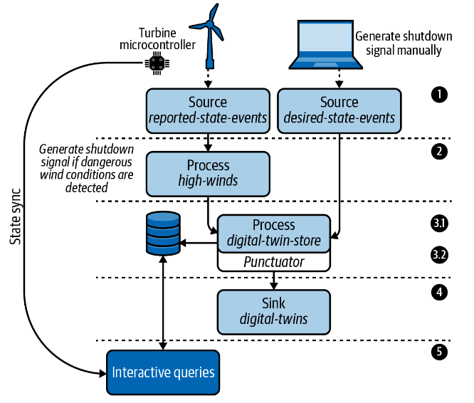

## IoT Digital Twin Service
We will use the Processor API to build a digital twin service for an offshore wind farm. 
Digital twins (sometimes called device shadows) are popular in both IoT (Internet of Things) and IIoT (industrial IoT) 
use cases, in which the state of a physical object is mirrored in a digital copy.
  
To give you a quick example of what a digital twin is, consider the following. We have a wind farm with 40 wind turbines. 
Whenever one of the turbines reports its current state (wind speed, temperature, power status, etc.), we save 
that information in a key-value store. Now, if we want to interact with a particular wind turbine, we don’t do so 
directly. IoT devices can and do frequently go offline, so we can achieve higher availability and reduce errors if 
we instead only interact with the digital copy (twin) of a physical device.
  
For example, if we want to set the power state from `ON` to `OFF`, instead of sending that signal to the turbine 
directly, we would set the so-called desired state on the digital copy. The physical turbine would subsequently 
synchronize its state (i.e., disable power to the blades) whenever it comes online, and usually at set intervals, 
thereafter. Therefore, a digital twin record will include both a reported and desired state, and we will create 
and expose digital twin records.

With this in mind, our application needs to ingest a stream of sensor data from a set of wind turbines, perform some 
minor processing on the data, and maintain the latest state of each wind turbine in a persistent key-value state store. 
We will then expose the data via Kafka Streams’ interactive queries feature.

## Topology

1. Our Kafka cluster contains two topics, and therefore we need to learn how to add source processors using the Processor API.
   1. Each wind turbine (edge node) is outfitted with a set of environmental sensors, and this data (e.g., wind speed), along with some metadata about the turbine itself (e.g., power state), is sent to the `reported-state-events` topic periodically.
   2. The `desired-state-events` topic is written to whenever a user or process wants to change the power state of a turbine (i.e., turn it off or on)
2. Since the environmental sensor data is reported in the `reported-state-events topic`, we will add a stream processor that determines whether the reported wind speed for a given turbine exceeds safe operating levels,6 and if it does, we will automatically generate a shutdown signal.
3. The third step is broken into two parts:
   1. First, both types of events (reported and desired) will be combined into a so-called digital twin record. These records will be processed and then written to a persistent key-value store called `digital-twin-store`
   2. The second part of this step involves scheduling a periodic function, called a punctuator, to clean out old digital twin records that haven’t seen an update in more than seven days.
4. Each digital twin record will be written to an output topic called digital-twins for analytical purposes.
5. We will expose the digital twin records via Kafka Streams’ interactive queries feature. Every few seconds, the microcontroller on the wind turbine will attempt to synchronize its own state with the desired state exposed by Kafka Streams

## Running Locally
Once Docker Compose is installed, you can start the local Kafka cluster using the following command:

```sh
$ docker-compose up
```

## Producing Test Data
Once your application is running, you can produce some test data to see it in action. 
Since our digital twin application reads from multiple topics (`reported-state-events`, `desired-state-events`), 
we have saved example records for each topic in the `data/` directory. First, produce some data to 
the `reported-state-events` topic using the following command:

```sh
$ docker-compose exec kafka bash -c "
  kafka-console-producer \
  --bootstrap-server kafka:9092 \
  --topic reported-state-events \
  --property 'parse.key=true' \
  --property 'key.separator=|' < reported-state-events.json"
```
  
Then you can produce the `desired-state-events` record using the following command:
```sh
$ docker-compose exec kafka bash -c "
  kafka-console-producer \
  --bootstrap-server kafka:9092 \
  --topic desired-state-events \
  --property 'parse.key=true' \
  --property 'key.separator=|' < desired-state-events.json"
```
  
## When to use the Processor API
In general, you may want to utilize the Processor API if you need to take advantage of the following:
- Access to record metadata (topic, partition, offset information, record headers, and so on)
- Ability to schedule periodic functions
- More fine-grained control over when records get forwarded to downstream processors
- More granular access to state stores
- Ability to circumvent any limitations you come across in the DSL