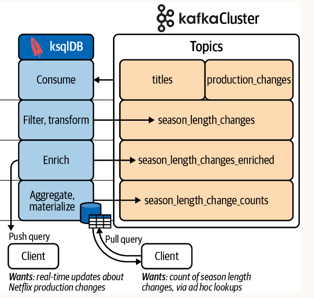

## Monitoring changes at Netflix
The goal of this application is simple. We need to consume a stream of production changes, filter and transform 
the data for processing, enrich and aggregate the data for reporting purposes, and ultimately make the processed 
data available to downstream systems. It sounds like a lot of work, but with `ksqlDB`, the implementation will 
be very straightforward.

The type of change we’ll be focusing on will be changes to a show’s season length 
(for example, Stranger Things, Season 4 may originally be slated for 12 episodes, but could be reworked into 
an 8-episode season, causing a ripple effect in various systems, including talent scheduling, cash projection, etc.). 
This example was chosen because it not only models a real-world problem, but also touches on the most common tasks 
you will tackle in your own ksqlDB applications.

## Topology

1. Our application will read from two topics:
   1. The `titles` topic is a compacted topic containing metadata (title name, release date, etc.) for films and television shows that are hosted on the Netflix service.
   2. The `production_changes` topic is written to whenever there is a talent scheduling, budgetary, release date, or season length change to a title that is currently in production.
2. After consuming the data from our source topics, we need to perform some basic preprocessing (e.g., filtering and transformation) in order to prepare the `production_changes` data for enrichment. The preprocessed stream, which will contain only changes to a title’s episode count/season length after it has been filtered, will be written to a Kafka topic named `season_length_changes`
3. We will then perform some data enrichment on the preprocessed data. Specifically, we will join the `season_length_changes` stream with the `titles` data to create a combined record from multiple sources and dimensions
4. Next, we will perform some windowed and non-windowed aggregations to count the number of changes in a five-minute period. The resulting table will be materialized, and made available for lookup-style pull queries
5. Finally, we will make the enriched and aggregated data available to two different types of clients. The first client will receive continuous updates via push queries, using a long-lived connection to ksqlDB. The second client will perform point lookups using short-lived pull queries that are more akin to traditional database lookups

## Running Locally
Once Docker Compose is installed, you can start the local Kafka cluster using the following command:

```sh
$ docker-compose up
```
Once the services are running, open another tab and log into the ksqlDB CLI using the following command:
```sh
$ docker-compose exec ksqldb-cli  ksql http://ksqldb-server:8088
```
Now, you can run each of the queries from the CLI:
- files/sql/ddl.sql
- files/sql/dml.sql
  
If you'd like to run all the queries in the above file, simply execute the following statement from the CLI:
```sh
ksql> RUN SCRIPT '/etc/sql/ddl.sql';
```

### Persistent Queries
`SELECT` queries like
```sql
SELECT title_id, before, after, created_at
FROM production_changes
EMIT CHANGES ;
```
are transient. The output is returned to the client, but not written back to Kafka.
`ksqlDB` also allows us to create so-called persistent queries, which write the results to Kafka and also survive 
server restarts. This is useful when you want to make your filtered, transformed, and/or enriched stream available 
to other clients. In order to write the results of a query back to Kafka, we can create derived collections. 

`Derived collections` are the product of creating streams and tables from other streams and tables. The syntax varies 
slightly from the way we create source collections, since we don’t specify the column schemas and there 
is an added `AS SELECT` clause.  
The queries for creating derived streams are often referred to by one of two acronyms:
- `CSAS` queries (CREATE STREAM AS SELECT) are used to create derived streams.
- `CTAS` queries (CREATE TABLE AS SELECT) are used to create derived tables.
  
Example:
```sql
CREATE STREAM season_length_changes
WITH( 
    ...
) AS SELECT ROWKEY, id, ...
     FROM stream_collection
     EMIT CHANGES;    
```